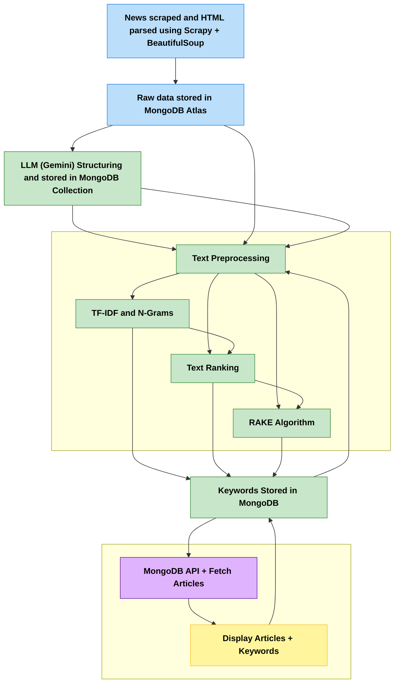

# 📰 News Spyder - AI Powered Cybersecurity News Aggregator

🌐 [**Live Deployed Website**](https://news-spyder.vercel.app/)

## 📚 Table of Contents

- [Key Features](https://github.com/rakheshkrishna2005/NewsSpyder?tab=readme-ov-file#-key-features)
- [Tech Stack](https://github.com/rakheshkrishna2005/NewsSpyder?tab=readme-ov-file#️-tech-stack)
- [Core Modules](https://github.com/rakheshkrishna2005/NewsSpyder?tab=readme-ov-file#-core-modules)
- [System Architecture](https://github.com/rakheshkrishna2005/NewsSpyder?tab=readme-ov-file#️-system-architecture)
- [UI Snapshots](https://github.com/rakheshkrishna2005/NewsSpyder?tab=readme-ov-file#-ui-snapshots)

## 🚀 Key Features

* 📰 **Automated Scraping** — Powered by **Scrapy + BeautifulSoup**, fetching real-time data from *The Hacker News*
* 🧠 **LLM-Powered Structuring** — Clean, concise content via **Google Gemini AI**
* 🏷️ **Smart Keywords** — Extracted using **TF-IDF**, **RAKE**, **TextRank**, and **LSA**
* 🌐 **Modern UI** — Built with **Next.js 14**, **Tailwind CSS**, and **shadcn/ui**

## ⚙️ Tech Stack

| Layer       | Tech                                                   |
| ----------- | ------------------------------------------------------ |
| 🔍 Scraping | `Scrapy`, `BeautifulSoup4`, `MongoDB Atlas`            |
| 🔤 NLP      | `nltk`, `scikit-learn`, `NetworkX`, `TextRank`, `RAKE` |
| 🧠 AI/LLM   | `Google Gemini`                           |
| 📦 Backend  | `MongoDB Atlas`, `Aggregation Pipelines`                 |
| 💻 Frontend | `Next.js`, `TypeScript`, `Tailwind`, `shadcn/ui`       |

## 🧩 Core Modules

### 🕸️ Scraper

* `Scrapy` spider + `BeautifulSoup` cleaning
* Asynchronous crawl pipeline to **MongoDB Atlas**

### 🧠 LLM Processor

* Content is parsed and structured via **Gemini AI**
* Summarization via **Gemini AI** by fetching MongoDB

### 🏷️ Keyword Engine

* NLP stack:

  * `TF-IDF` for relevance
  * `RAKE` for phrase scoring
  * `TextRank` via `NetworkX` for semantic relations

### 🖥️ Frontend

* Fully responsive **Next.js 15** app
* SSR, dynamic routes, fuzzy search, dark mode

## 🏗️ System Architecture

## 📸 UI Snapshots

